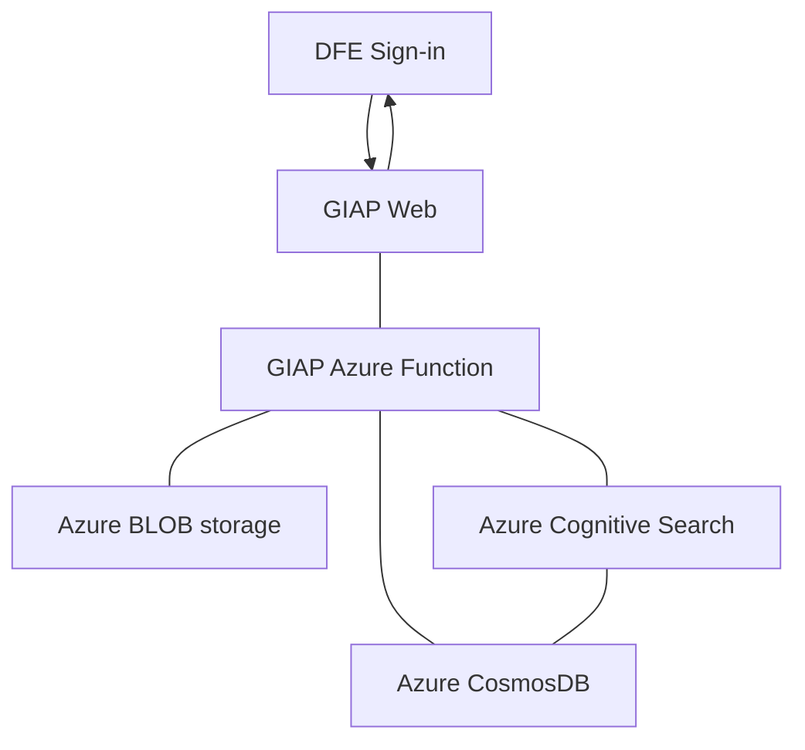

[](https://sonarcloud.io/summary/new_code?id=DFE-Digital_get-information-about-pupils)
[](https://sonarcloud.io/summary/new_code?id=DFE-Digital_get-information-about-pupils) [](https://sonarcloud.io/summary/new_code?id=DFE-Digital_get-information-about-pupils) [](https://sonarcloud.io/summary/new_code?id=DFE-Digital_get-information-about-pupils) [](https://sonarcloud.io/summary/new_code?id=DFE-Digital_get-information-about-pupils) [](https://sonarcloud.io/summary/new_code?id=DFE-Digital_get-information-about-pupils) [](https://sonarcloud.io/summary/new_code?id=DFE-Digital_get-information-about-pupils)

# Get Information About Pupils (GIAP)

> The Get Information About Pupils (GIAP) service allows education professionals to search
> the [National Pupil Database](https://www.find-npd-data.education.gov.uk/) to retrieve pupil data.

> GIAP is the replacement for the legacy service Key to Success (KtS).
> It allows education professionals to search the National Pupil Database to retrieve pupil data,
> and the following to access pupil-level census and attainment data:
>
> - schools
> - academies
> - further education colleges
> - academy trusts
> - local authorities
>
> GIAP also allows users to create and maintain their own custom lists of pupils,
> making it easy to track the progress of specific groups or cohorts over time.
>
> The service provides access to [pupil premium](https://www.gov.uk/government/publications/pupil-premium/pupil-premium)
> funding allocation, helping schools effectively manage the financial aspects of new student enrolment from the start.
>
> https://www.gov.uk/guidance/get-information-about-pupil-giap

## Development quick-start

1. Prerequisites
    - [Git](https://git-scm.com/downloads) (for getting a copy of the source code and contributing changes)
    - [.NET 8 SDK](https://dotnet.microsoft.com/en-us/download/dotnet/8.0) (for building and running the C#/.NET web
      application)
    - [Node.js](https://nodejs.org/en/download/) (for building web artefacts: (S)CSS, JS, etc.)
    - IDE/Editor of choice (e.g., Visual Studio, Visual Studio Code, JetBrains Rider, etc.)
    - Local environment configured to authenticate to the GitHub NuGet feed
      - Create a classic [personal access token (PAT)](https://docs.github.com/en/authentication/keeping-your-account-and-data-secure/managing-your-personal-access-tokens) with `read:packages` scope from your GitHub account (fine-grained tokens [do not support package scopes](https://github.com/github/roadmap/issues/558)).
      - Add the NuGet source to your local environment by filling in the placeholders and running:
        ```sh
        dotnet nuget add source --username <YOUR_GITHUB_USERNAME> --password <YOUR_PERSONAL_ACCESS_TOKEN> --store-password-in-clear-text --name dfedigital "https://nuget.pkg.github.com/DFE-Digital/index.json"
        ```
2. Clone the repository
    - ```sh
      git clone https://github.com/DFE-Digital/get-information-about-pupils
      ```
3. Install node dependencies, then build and package the web artefacts (JS, CSS, etc.)
    - ```sh
      ## DfE.GIAP.All/DfE.GIAP.Web/
      npm install
      npm run gulp
      ```
4. Build the C#/.NET solution
    - ```sh
      ## cd DfE.GIAP.All/
      dotnet build
      ```
5. Confirm tests are passing locally
    - ```sh
      ## cd DfE.GIAP.All/
      dotnet test
      ```
6. Set up local configuration files/settings
    - Create `appsettings.local.json` within the `DfE.GIAP.Web` project (`DfE.GIAP.All/DfE.GIAP.Web/DfE.GIAP.Web/`).
        - Populate with the required settings (see the section below for an example).
    - Set local secrets
        - TODO: Add instructions for setting up local secrets using `dotnet user-secrets` or similar.
7. Run the application
    - ```sh
      ## cd DfE.GIAP.All/DfE.GIAP.Web/
      dotnet run
      ```
    - If using Visual Studio, ensure the `DfE.GIAP.Web` project is set as the startup project and run it (F5 or use the
      menu).


## Architecture

### Application Infrastructure

GIAP-Web relies on a set of Azure Functions in the GIAP.AzureFunctions application, these then query Azure Cognitive
Services/CosmosDB for data. The initial access is granted via [DSI](https://services.signin.education.gov.uk/) which
provides authentication and authorisation to the application.



### Data flows

- Data is first ingested into the GIAP system via data pipelines.
  - Note: These pipelines are maintained by the DfE data engineering team, therefore are out of scope of this repository.
- The GIAP web application queries Azure Functions to retrieve data (note: work-in-progress to remove this, instead to
  query directly).

### Project dependencies

GIAP web has a number of dependencies listed below, some are closed source, others are open.

- .NET 8
- node
- gulp
- DSI (DfE sign-in)
- [CosmosDb Infrastructure library](https://github.com/DFE-Digital/infrastructure-persistence-cosmosdb)

### Build and Test

Press Ctrl+Shift+B (if you are using Visual Studio) to build the project. To run all tests in Visaul Studio, select
Tests from top menu and run all unit tests.
Unit tests live in the Unit Test project folder and use XUnit, NSubstitute, and Moq. There exists testing projects for
Common Layer, Service Layer, and Web Layer.
Unit tests should be written in the form {TARGET CLASS OR MODULE}_{EXPECTED_OUTCOME}_WHEN_{CONDITION}

### Settings

There are a number of key settings contained in the `appsettings.json` file. It is recommended to create an
`appsettings.local.json` file to store values as they won't be checked into source control as `.gitignore`. An example
is provided for reference, additionally a launchSettings.json is required in Properties.

> launchSettings.json

```json
{
    "iisSettings": {
        "windowsAuthentication": false,
        "anonymousAuthentication": true,
        "iisExpress": {
            "applicationUrl": "https://localhost:44378",
            "sslPort": 44378
        }
    },
    "profiles": {
        "IIS Express": {
            "commandName": "IISExpress",
            "launchBrowser": true,
            "environmentVariables": {
                "ASPNETCORE_ENVIRONMENT": "Local"
            }
        },
        "DfE.GIAP.Web": {
            "commandName": "Project",
            "launchBrowser": true,
            "environmentVariables": {
                "ASPNETCORE_ENVIRONMENT": "Local"
            },
            "applicationUrl": "https://localhost:44378;http://localhost:5000"
        }
    }
}
```

> appsettings.local.json

```json

{
    "AppVersion": "2.Local",
    "SessionTimeout": 20,
    "IsSessionIdStoredInCookie": true,
    "MaximumNonUPNResults": 100,
    "MaximumNonULNResults": 100,
    "MaximumUPNsPerSearch": 4000,
    "DsiClientId": "dsi-client-id",
    "DsiClientSecret": "dsi-client-secret",
    "DsiApiClientSecret": "dsi-api-client-secret",
    "DsiMetadataAddress": "dsi-metadata-address",
    "DsiAuthorisationUrl": "dsi-authorisation-url",
    "DsiRedirectUrlAfterSignout": "dsi-redirect-url-after-signout",
    "DsiServiceId": "dsi-service-id",
    "DsiAudience": "dsi-audience",
    "StorageAccountName": "account-name",
    "StorageAccountKey": "account-key",
    "StorageContainerName": "container-name",
    "NonUpnPPLimit": 4000,
    "NonUpnNPDMyPupilListLimit": 100,
    "UpnPPMyPupilListLimit": 4000,
    "UpnNPDMyPupilListLimit": 4000,
    "MaximumULNsPerSearch": 4000,
    "CommonTransferFileUPNLimit": 10,
    "MetaDataDownloadListDirectory": "AllUsers/Metadata",
    "DownloadOptionsCheckLimit": 500,
    "UseLAColumn": true,
    "NpdUseGender": true,
    "PpUseGender": false,
    "FeUseGender": false,
    "FeatureManagement": {
        "FurtherEducation": true
    },
    "SecurityHeaders": {
        "Remove": [
            "Server",
            "X-Powered-By"
        ],
        "Add": {
            "Strict-Transport-Security": "max-age=31536000; includeSubDomains; preload",
            "X-XSS-Protection": "0",
            "X-Content-Type-Options": "nosniff",
            "X-Frame-Options": "DENY",
            "Content-Security-Policy": "default-src 'self';"
        }
    },
    "GetUserProfileUrl": "http://localhost:7071/api/get-user-profile?code=",
    "GetLatestNewsStatusUrl": "http://localhost:7071/api/get-latest-news-status?code=",
    "DeleteNewsArticleUrl": "http://localhost:7071/api/delete-news-article?code=",
    "DownloadPupilsByUPNsCSVUrl": "http://localhost:7071/api/download-pupils-by-upns-csv?code=",
    "DownloadPupilsByUPNsTABUrl": "http://localhost:7071/api/download-pupils-by-upns-tab?code=",
    "DownloadPupilPremiumByUPNFforCSVUrl": "http://localhost:7071/api/download-pupil-premium-by-upns-csv?code=",
    "GetContentByIDUrl": "http://localhost:7071/api/get-content-by-id?code=",
    "QueryLAByCodeUrl": "http://localhost:7071/api/get-la-by-code?code=",
    "QueryLAGetAllUrl": "http://localhost:7071/api/get-la-all?code=",
    "GetAcademiesURL": "http://localhost:7071/api/get-academies?code=",
    "QueryNewsArticleUrl": "http://localhost:7071/api/get-news-article-by-id?code=",
    "QueryNewsArticlesUrl": "http://localhost:7071/api/get-news-articles?code=",
    "UpdateNewsDocumentUrl": "http://localhost:7071/api/update-news-document?code=",
    "UpdateNewsPropertyUrl": "http://localhost:7071/api/update-news-article-property?code=",
    "LoggingEventUrl": "http://localhost:7071/api/logging-event?code=",
    "CreateOrUpdateUserProfileUrl": "http://localhost:7071/api/create-or-update-user-profile?code=",
    "DownloadCommonTransferFileUrl": "http://localhost:7071/api/download-common-transfer-file?code=",
    "DownloadSecurityReportByUpnUrl": "http://localhost:7071/api/download-security-report-by-upn-searches?code=",
    "DownloadSecurityReportByUlnUrl": "http://localhost:7071/api/download-security-report-by-uln-searches?code=",
    "DownloadSecurityReportDetailedSearchesUrl": "http://localhost:7071/api/download-detailed-searches?code=",
    "DownloadSecurityReportLoginDetailsUrl": "http://localhost:7071/api/download-login-details?code=",
    "DownloadPupilsByULNsUrl": "http://localhost:7071/api/download-further-education?code=",
    "DownloadPrepreparedFilesUrl": "http://localhost:7071/api/pre-prepared-downloads?code=",
    "PaginatedSearchUrl": "http://localhost:7071/api/get-page/{indexType}/{queryType}?code=",
    "GetAllFurtherEducationURL": "http://localhost:7071/api/get-all-fe?code=",
    "GetFurtherEducationByCodeURL": "http://localhost:7071/api/get-fe-by-code?code=",
    "SetLatestNewsStatusUrl": "http://localhost:7071/api/set-latest-news-status?code=",
    "FeatureFlagAppConfigUrl": "Endpoint="
}

```

### Continual Integration (CI)

`giap-web` has an [build pipeline](.github/workflows/web-application-cicd.yml) which runs on each commit.

The solution depends on the DfEDigital GitHub Packages NuGet Feed.

### Logging

GIAP uses Application Insights to log auditing, warnings, and errors.

### Gulp Runner

In this project, we have a Gulp task which combines the JS files and CSS files into a minified version.
We’re using npm to install dependencies.
We need to install Gulp globally.
Assuming you have node and npm installed already.

```sh
npm install -g gulp
```

This installs it system wide as opposed to installing on a project-by-project basis.
Gulp runner also compile Sass (for CSS styling) files into CSS. Unfortunately, SCSS won’t work out of the box.
Some browsers don’t understand what SASS/SCSS syntax is, so we need to compile it down to a plain CSS file for them.
The only library we need will be `gulp-sass`, so install it like this:

```sh
npm install gulp-sass
```

You may notice you have a `package.json` and `package-lock.json` file.
This process also creates a `node_modules` directory within the solution folder.

- `gulp-sass`: Sass is a pre-processor and to run in the browsers it needs to be compiled into CSS, that’s why we need
  `gulp-sass`, this gulp plugin will compile the SCSS files into CSS.
- `gulp-rename`: this gulp plugin is useful if we want to change the extension file names.

The Gulp task runs behind the scenes when you compile your project.

## Licence

Unless stated otherwise, the codebase is released under the MIT Licence.
This covers both the codebase and any sample code in the documentation.

The documentation is © Crown copyright and available under the terms of the Open Government 3.0 licence

## Status pages

| Tool   | StatusPage                     | Usage                                 |
|--------|--------------------------------|---------------------------------------|
| GitHub | <https://www.githubstatus.com> | Source code, GitHub actions for CI/CD |
| Azure  | <https://status.azure.com>     | CIP Infrastructure                    |
| npm    | <https://status.npmjs.org>     | `npm` package restore                 |
| NuGet  | <https://status.nuget.org>     | `dotnet` package restore              |
