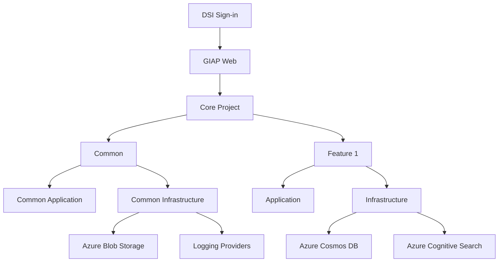

[](https://sonarcloud.io/summary/new_code?id=DFE-Digital_get-information-about-pupils)
[](https://sonarcloud.io/summary/new_code?id=DFE-Digital_get-information-about-pupils)
[](https://sonarcloud.io/summary/new_code?id=DFE-Digital_get-information-about-pupils)
[](https://sonarcloud.io/summary/new_code?id=DFE-Digital_get-information-about-pupils)
[](https://sonarcloud.io/summary/new_code?id=DFE-Digital_get-information-about-pupils)
[](https://sonarcloud.io/summary/new_code?id=DFE-Digital_get-information-about-pupils)
[](https://sonarcloud.io/summary/new_code?id=DFE-Digital_get-information-about-pupils)

| Tool   | StatusPage | Usage |
|--------|------------|-------|
| GitHub | <https://www.githubstatus.com> | Source code, GitHub actions for CI/CD |
| Azure | <https://status.azure.com> | CIP Infrastructure |
| npm | <https://status.npmjs.org> | `npm` package restore |
| NuGet | <https://status.nuget.org> | `dotnet` package restore |

# Get Information About Pupils

The Get Information About Pupils (GIAP) service allows education professionals to search
the [National Pupil Database](https://www.find-npd-data.education.gov.uk/) to retrieve pupil data.
GIAP is the replacement for the legacy service Key to Success (KtS).
It allows education professionals to search the National Pupil Database to retrieve pupil data,
and the following to access pupil-level census and attainment data:

- schools
- academies
- further education colleges
- academy trusts
- local authorities

GIAP also allows users to create and maintain their own custom lists of pupils,
making it easy to track the progress of specific groups or cohorts over time.

The service provides access to [pupil premium](https://www.gov.uk/government/publications/pupil-premium/pupil-premium)
funding allocation, helping schools effectively manage the financial aspects of new student enrolment from the start.

https://www.gov.uk/guidance/get-information-about-pupil-giap


## Getting Started / Setup

Read the [GIAP wiki](https://github.com/DFE-Digital/get-information-about-pupils-wiki)
  - [Onboarding](https://github.com/DFE-Digital/get-information-about-pupils-wiki/blob/main/runbooks/onboarding.md)
  - [Environments](https://github.com/DFE-Digital/get-information-about-pupils-wiki/blob/main/runbooks/environments.md)
  - [Deployment](https://github.com/DFE-Digital/get-information-about-pupils-wiki/blob/main/runbooks/deployments.md)
  - [ADRs](https://github.com/DFE-Digital/get-information-about-pupils-wiki/adr)

Prerequisites
- [Git](https://git-scm.com/downloads) (for getting a copy of the source code and contributing changes)
- [.NET 8 SDK](https://dotnet.microsoft.com/en-us/download/dotnet/8.0) (for building and running the C#/.NET web
application)
- [Node.js](https://nodejs.org/en/download/) (for building web artefacts: (S)CSS, JS, etc.)
- IDE/Editor of choice (e.g., Visual Studio, Visual Studio Code, JetBrains Rider, etc.)
- Local environment configured to authenticate to the GitHub NuGet feed
    - Create a classic [personal access token (PAT)](https://docs.github.com/en/authentication/keeping-your-account-and-data-secure/managing-your-personal-access-tokens) with `read:packages` scope from your GitHub account (fine-grained tokens [do not support package scopes](https://github.com/github/roadmap/issues/558)).
    - Add the NuGet source to your local environment by filling in the placeholders and running:
    ```sh
    dotnet nuget add source --username <YOUR_GITHUB_USERNAME> --password <YOUR_PERSONAL_ACCESS_TOKEN> --store-password-in-clear-text --name dfedigital "https://nuget.pkg.github.com/DFE-Digital/index.json"
    ```
Clone the repository
```sh
git clone https://github.com/DFE-Digital/get-information-about-pupils
```
Install node dependencies, then build and package the web artefacts (JS, CSS, etc.)
```sh
## DfE.GIAP.All/DfE.GIAP.Web/
npm install
npm run gulp
```

If you have `gulp` installed globally (`npm install -g gulp`), you can run `gulp` directly:
```sh
## DfE.GIAP.All/DfE.GIAP.Web/
gulp
```
Build the C#/.NET solution
```sh
## cd DfE.GIAP.All/
dotnet build
```

Confirm tests are passing locally
```sh
## cd DfE.GIAP.All/
dotnet test
```

Run the application
```sh
## cd DfE.GIAP.All/DfE.GIAP.Web/
dotnet run
```

If using Visual Studio, ensure the `DfE.GIAP.Web` project is set as the startup project and run it (F5 or use the
menu).


## Architecture

GIAP‑Web authenticates users through DSI, which provides both authentication and authorisation.
Once authenticated, the application interacts with the Core Project, which contains all feature logic and shared (common) functionality.

The Core Project delegates work to feature‑specific Application/Infrastructure layers and shared Common services.
Infrastructure components then communicate with Azure services such as Cosmos DB, Cognitive Search, and Blob Storage.


```mermaid
graph TD

%% ENTRY POINT
DSI[DSI Sign-in] --> UI[GIAP Web]
UI --> CORE[Core Project]

%% COMMON LAYER
CORE --> COMMON[Common]
COMMON --> CA[Common Application]
COMMON --> CI[Common Infrastructure]

CI --> BLOB[Azure Blob Storage]
CI --> LOG[Logging Providers]

%% FEATURE 1
CORE --> FEATURE1[Feature 1]
FEATURE1 --> F1_APP[Application]
FEATURE1 --> F1_INFRA[Infrastructure]

F1_INFRA --> COSMOS[Azure Cosmos DB]
F1_INFRA --> SEARCH[Azure Cognitive Search]
```

### Project dependencies

GIAP web has a number of dependancies listed below, some are closed source, others are open.

- .NET 8
- node
- gulp
- DSI (DfE sign-in)
- [Azure CosmosDb library](https://github.com/DFE-Digital/infrastructure-persistence-cosmosdb)
- [Azure AISearch library](https://github.com/DFE-Digital/infrastructure-cognitive-search)
- [DfE CleanArchitecture Application, Domain and CrossCutting libraries](https://github.com/DFE-Digital/cleanarch-crosscutting)

### Settings

There are a number of key settings contained in the `appsettings.json` file.
It is recommended to create an `appsettings.local.json` file to store values as they won't be checked into source control as `.gitignore`.

An example is provided for reference, additionally a launchSettings.json is required in Properties.

### launchSettings.json
```json
{
  "iisSettings": {
    "windowsAuthentication": false,
    "anonymousAuthentication": true,
    "iisExpress": {
      "applicationUrl": "https://localhost:44378",
      "sslPort": 44378
    }
  },
  "profiles": {
    "IIS Express": {
      "commandName": "IISExpress",
      "launchBrowser": true,
      "environmentVariables": {
        "ASPNETCORE_ENVIRONMENT": "Local"
      }
    },
    "DfE.GIAP.Web": {
      "commandName": "Project",
      "launchBrowser": true,
      "environmentVariables": {
        "ASPNETCORE_ENVIRONMENT": "Local"
      },
      "applicationUrl": "https://localhost:44378;http://localhost:5000"
    }
  }
}
```

### appsettings.local.json
```json
{
    "RepositoryOptions": {
        "EndpointUri": "",
        "PrimaryKey": "",
    },
    "BlobStorageOptions": {
        "AccountName": "STORAGE_ACCOUNT_NAME",
        "AccountKey": "STORAGE_ACCOUNT_KEY",
        "ContainerName": "STORAGE_CONTAINER_NAME",
        "EndpointSuffix": "ENDPOINT_SUFFIX"
    },
    "SearchIndexOptions": {
        "Url": "https://s115d10-asearch-giap.search.windows.net",
        "Key": "KEY_HERE",
        "Indexes": {
            "npd": {
                "Name": "NPD-INDEX-NAME"
            },
            "pupil-premium": {
                "Name": "PUPILPREMIUM-INDEX-NAME"
            }
        }
    },
    "AzureSearchConnectionOptions": {
        "EndpointUri": "ENDPOINT_URI",
        "Credentials": "CREDENTIAL_KEY"
    },
     "DsiOptions": {
        "ServiceId": "SERVICE_ID",
        "ClientId": "CLIENT_ID",
        "ClientSecret": "CLIENT_SECRET",
        "ApiClientSecret": "API_CLIENT_SECRET",
        "Audience": "AUDIENCE",
        "MetadataAddress": "DSI_METADATA_ADDRESS",
        "AuthorisationUrl": "DSI_AUTHORISATION_URL",
        "RedirectUrlAfterSignout": "REDIRECT_URL_AFTER_SIGNOUT",
        "CallbackPath": "CALLBACK_PATH",
        "SignedOutCallbackPath": "SIGNED_OUT_CALLBACK",
        "SessionTimeoutMinutes": 10
    },
}

```

## Continual Integration (CI)

`giap-web` has an [build pipeline](./github/ci.yml) which runs on each commit.

The solution depends on the DfEDigital GitHub Packages NuGet Feed.

## Logging

GIAP uses Application Insights for all auditing, warnings, and error logging.

This provides centralised telemetry across the application, making it easier to trace issues, monitor performance, and analyse user behaviour.

## License

Unless stated otherwise, the codebase is released under the MIT License. This covers both the codebase and any sample code in the documentation.

The documentation is © Crown copyright and available under the terms of the Open Government 3.0 licence
