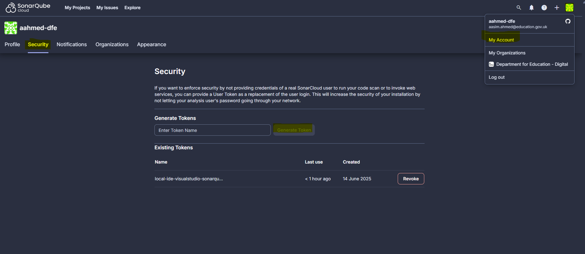
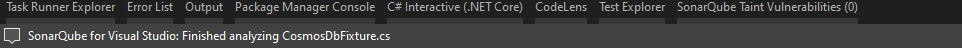
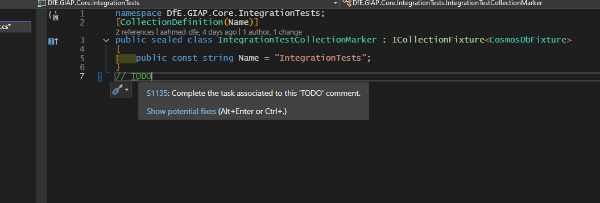

# SonarQube

We use the DFE-Digital managed SonarQube Cloud to perform static code analysis for code smells, duplicated code and other similar issues

## Setup

Creating the project in SonarQube is granted through a ServiceNow request to Digital Tools Support (see #digital-tools-support in DfE slack)

## Local development

SonarQube provide a free [VisualStudio extension](https://docs.sonarsource.com/sonarqube-for-ide/visual-studio/getting-started/installation/).

This can be connected through your IDE using to run analysis based on the same `QualityProfile` and issue-tolerance as the remote SonarQube cloud project
This helps to resolve issues locally that would show up in a scan at PR

Documentation

- [Connecting locally](https://docs.sonarsource.com/sonarqube-for-ide/visual-studio/team-features/connected-mode-setup/#sonarqube-cloud)
- [How SonarQube scans](https://docs.sonarsource.com/sonarqube-for-ide/visual-studio/using/scan-my-project/#scanning-csharp-and-vbnet)

As of 14/06/2025 connecting in IDE requires generating a token and binding that through the IDE connection wizard

Files are scanned on open by default and should show warning analyzers if issue detected. Insert a // TODO to test

